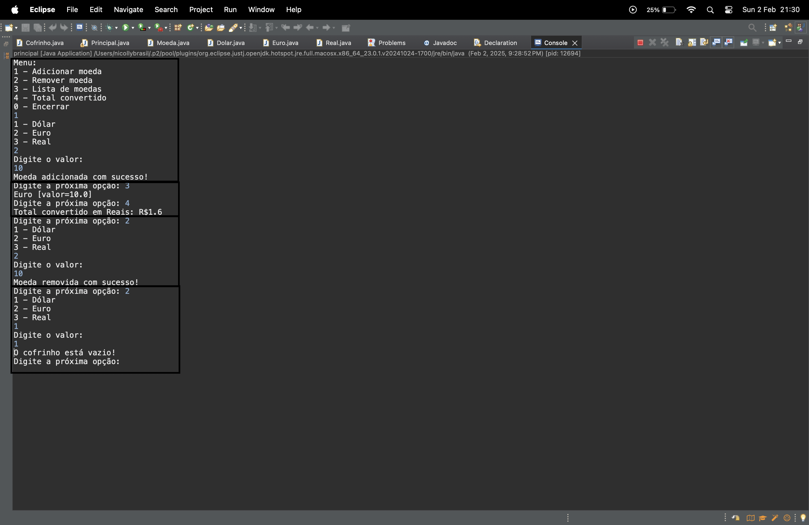

# Cofrinho Java

Simulador de um Cofrinho feito em Java. Opção para adicionar diferentes moedas (euro, dólar e real). Cotação desatualizada.
## Aprendizado

- Java
- Classes
- Herança
- Lógica de programação

## Demonstração no eclipse

